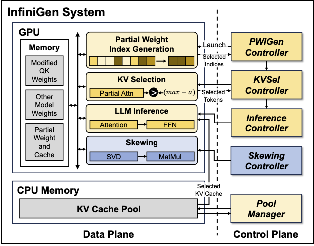

# InfiniGen: Efficient Generative Inference of Large Language Models with Dynamic KV Cache Management
[[paper](https://arxiv.org/abs/2406.19707)]



## Overview

This repository contains the code for the artifact evaluation of our paper "InfiniGen: Efficient Generative Inference of Large Language Models with Dynamic KV Cache Management".

- Getting Started (10 minutes)
- Run Experiments

## Abstract

Transformer-based large language models (LLMs) demonstrate impressive performance across various natural language processing tasks. Serving LLM inference for generating long contents, however, poses a challenge due to the enormous memory footprint of the transient state, known as the key-value (KV) cache, which scales with the sequence length and batch size. In this paper, we present InfiniGen, a novel KV cache management framework tailored for long-text generation, which synergistically works with modern offloading-based inference systems. InfiniGen leverages the key insight that a few important tokens that are essential for computing the subsequent attention layer in the Transformer can be speculated by performing a minimal rehearsal with the inputs of the current layer and part of the query weight and key cache of the subsequent layer. This allows us to prefetch only the essential KV cache entries (without fetching them all), thereby mitigating the fetch overhead from the host memory in offloading-based LLM serving systems. Our evaluation on several representative LLMs shows that InfiniGen improves the overall performance of a modern offloading-based system by up to 3.00x compared to prior KV cache management methods while offering substantially better model accuracy.

## Getting Started (10 minutes)

```sh
git clone https://github.com/snu-comparch/infinigen
conda create -n infinigen python=3.9
conda activate infinigen
pip install -r requirements.txt
```

## Run Experiments

We provide the scripts for accuracy and speedup evaluation.
You can find the source code for accuracy evaluation in the `accuracy` directory and speedup evaluation in the `speedup` directory.
It takes about 40 hours and 7 hours for the accuracy and speedup experiments, respectively.

## Citation

```bibtex
@inproceedings{lee-osdi24,
  title = {{I}nfini{G}en: Efficient Generative Inference of Large Language Models with Dynamic KV Cache Management},
  author = {Lee, Wonbeom and Lee, Jungi and Seo, Junghwan and Sim, Jaewoong},
  booktitle = {18th USENIX Symposium on Operating Systems Design and Implementation (OSDI 24)},
  year = {2024}
}
```
